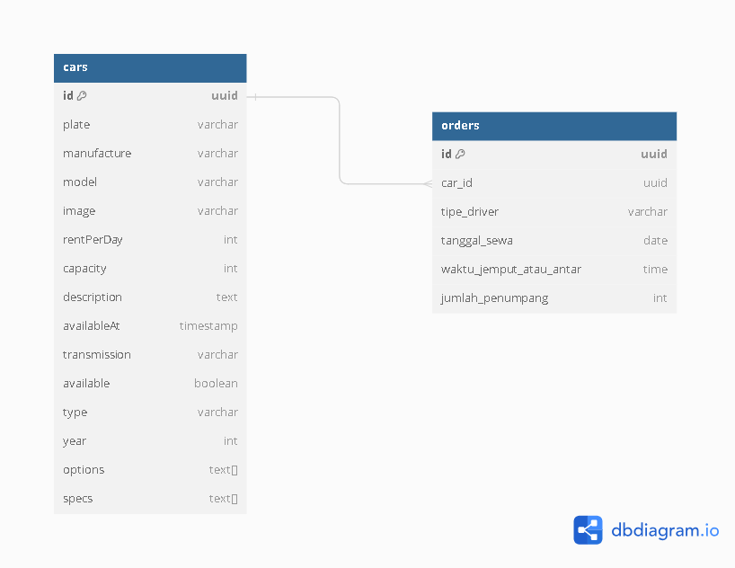

# Challenge 5 SYNRGY

# Car Database Schema

# Installation Guide

| Step          | Command                   | Description                                  |
| ------------- | ------------------------- | -------------------------------------------- |
| Install       | `npm install`             | Install required npm packages.               |
| Database      | `docker compose up -d`    | Start the database using Docker Compose.     |
| Run Migration | `npx knex migrate:latest` | Run database migrations for the application. |
| Run Seeder    | `npx knex seed:run`       | Seed the database with initial data.         |
| Run App       | `npm run dev`             | Start the application in development mode.   |

# Documentation for Car Rental API

This is a documentation for the Car Rental API that provides endpoints to manage cars and orders within the car rental system.

## Routes and Functions

| Route       | HTTP Method | Description                                       | Parameters                                                                                                                                                                                   | Usage                | Function                                                                                             |
| ----------- | ----------- | ------------------------------------------------- | -------------------------------------------------------------------------------------------------------------------------------------------------------------------------------------------- | -------------------- | ---------------------------------------------------------------------------------------------------- |
| /cars       | GET         | Retrieve all cars or filter cars by plate number. | `plate` (optional): Filter cars by plate number.                                                                                                                                             | `/cars?plate=ABC123` | Retrieves a list of all cars or filters cars by plate number if `plate` query parameter is provided. |
| /cars       | POST        | Create a new car entry.                           | `make`: Car manufacturer.   `model`: Car model.   `plate`: Car registration plate number.   `specs`: Car specifications in JSON format.   `options`: Car options in JSON format. | `/cars`              | Creates a new entry for a car in the system.                                                         |
| /cars/:id   | GET         | Retrieve details of a car by its ID.              | -                                                                                                                                                                                            | `/cars/1`            | Retrieves details of a specific car based on its ID.                                                 |
| /cars/:id   | PATCH       | Update details of a car by its ID.                | Any fields that need updating for the car.                                                                                                                                                   | `/cars/1`            | Updates details of a specific car based on its ID.                                                   |
| /cars/:id   | DELETE      | Delete a car entry by its ID.                     | -                                                                                                                                                                                            | `/cars/1`            | Deletes a specific car based on its ID.                                                              |
| /orders/:id | GET         | Retrieve details of an order by its ID.           | -                                                                                                                                                                                            | `/orders/1`          | Retrieves details of a specific order based on its ID.                                               |
| /orders     | POST        | Create a new order entry.                         | Any fields required to create a new order.                                                                                                                                                   | `/orders`            | Creates a new entry for an order in the system.                                                      |
| /orders/:id | PATCH       | Update details of an order by its ID.             | Any fields that need updating for the order.                                                                                                                                                 | `/orders/1`          | Updates details of a specific order based on its ID.                                                 |
| /orders/:id | DELETE      | Delete an order entry by its ID.                  | -                                                                                                                                                                                            | `/orders/1`          | Deletes a specific order based on its ID.                                                            |

## How to Use

Make requests to the respective endpoints using appropriate HTTP methods (GET, POST, PATCH, DELETE) along with required parameters or request body as mentioned above.

Ensure to handle errors appropriately and validate input data before making requests to the API.
